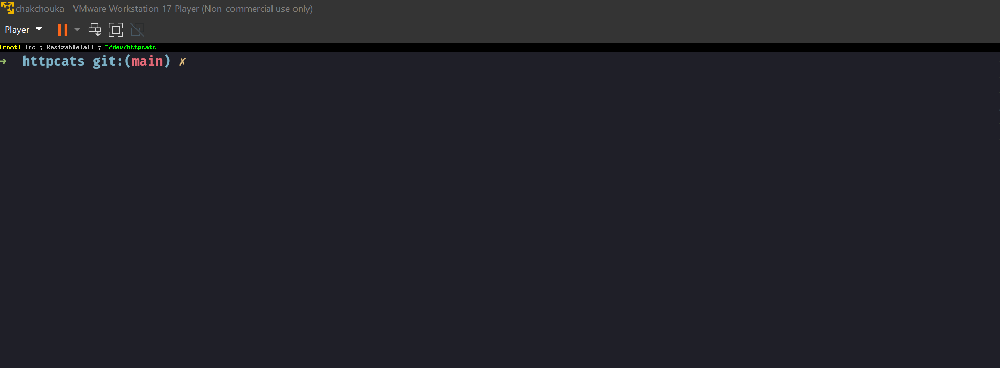

# A simple HTTP client (http/1.1 & h2) with [Miou][miou]



```ocaml
$ git clone https://github.com/robur-coop/httpcats
$ cd httpcats
$ opam pin add -yn .
$ dune build app/pars.exe
$ cat >to_download.txt <<EOF
https://builds.osau.re/job/bob/build/latest/f/bin/bob.com
EOF
$ dune exec app/pars.exe -- < to_download.txt
```

**NOTE**: it requires the upstream version of `miou`!

- [x] Fix the issue between HTTP/1.1 and TLS (and close-notify)
- [ ] Implement some tests
- [ ] Documentation (.ml & .mli)
- [ ] DNS resolution over UDP
- [ ] DNS over TLS
- [ ] happy-eyeballs

[miou]: https://github.com/robur-coop/miou
